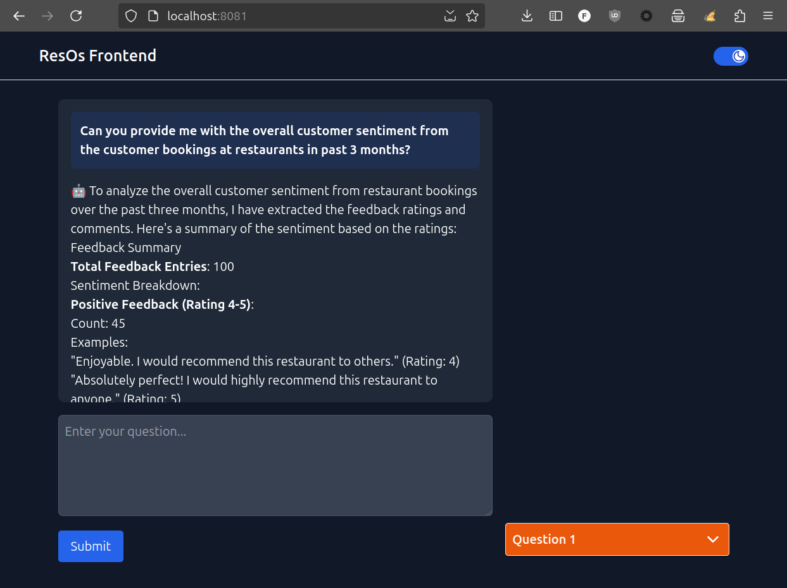

# Developing a Spring AI Enhanced Restaurant Booking System Employing an API-first Approach

[](https://img.shields.io/badge/Release-Alpha-darkred)  [](https://snyk.io/test/github/pacphi/spring-ai-resos)

This multi-module project hosts a client code-generated from an OpenAPI derivative of the ResOs API combined with a Spring AI implementation.
It also includes an MCP server, MCP client configuration for use with Claude and a standalone ReactJS powered chatbot UI.

- [Background](#background)
- [Getting started](#getting-started)
- [Prerequisites](#prerequisites)
- How to
  - [Clone](#how-to-clone)
  - [Build](#how-to-build)
  - [Consume](#how-to-consume)
  - [Run](#how-to-run)
- Documentation
  - [Architecture](docs/architecture/) - Comprehensive architecture documentation
  - [Planning](docs/planning/) - Roadmap and future work
  - [Project Origin](docs/archives/mvp/SPARK.md) - How this project started
- Also see
  - [ResOS API](https://documenter.getpostman.com/view/3308304/SzzehLGp?version=latest) - External API reference

## Background

As a Spring Boot and Spring AI developer, I want
to consume libraries that make it convenient to add capabilities to my application(s)
as for the following

Use-case:

- Imagine instead of using OpenTable or Tock you could converse with a chatbot to search for restaurant(s) and make reservation(s) on your behalf.

## Technologies

- Spring Boot 4.0.1
- Spring AI 2.0.0-M1
- Spring Cloud 2025.1.0
- Spring Security 7.0.2
- Java 25
- Maven 3.9.11

## Getting started

Start with:

- A Github [account](https://github.com/signup)
- (Optional) An [API key](https://resos.com/support/how-to-use-resos-rest-api/) from ResOS
  - you only need one if you intend to register as a restaurateur!
  - we will spin up a [backend](backend) that is API-compatible, implemented with Spring Boot Starter Data JDBC
- An LLM provider
  - e.g., Groq Cloud, OpenRouter, or OpenAI

## Prerequisites

- Git CLI (2.43.0 or better)
- Github CLI (2.65.0 or better)
- httpie CLI (3.2.2 or better)
- Java SDK (25 or better)
- Maven (3.9.11 or better)
- an LLM provider account (if using public cloud or commercially hosted models)

## How to clone

with Git CLI

```bash
git clone https://github.com/pacphi/spring-ai-resos
```

with Github CLI

```bash
gh repo clone pacphi/spring-ai-resos
```

## How to build

Open a terminal shell, then execute:

```bash
cd spring-ai-resos
mvn clean install
```

## How to consume

If you want to incorporate any of the starters as dependencies in your own projects, you would:

### Add dependency

Maven

```maven
<dependency>
    <groupId>me.pacphi</groupId>
    <artifactId>spring-ai-resos-client</artifactId>
    <version>{release-version}</version>
</dependency>
```

Gradle

```gradle
implementation 'me.pacphi:spring-ai-resos-client:{release-version}'
```

> Replace occurrences of {release-version} above with a valid artifact release version number

### Add configuration

Following Spring Boot conventions, you would add a stanza like this to your:

application.properties

```properties
default.url=${RESOS_API_ENDPOINT:https://api.resos.com/v1}
```

application.yml

```yaml
default:
  url: ${RESOS_API_ENDPOINT:https://api.resos.com/v1}
```

> To activate the client, specify an API key (if required), and tune other associated configuration.

Consult the [chatbot](mcp-client) module's configuration for alternative `dependencies` and `configuration` that are available to add.

Configuration will be found in labeled `spring.config.activate.on-profile` sections of the [application.yml](mcp-client/src/main/resources/application.yml) file.

## How to run

You're going to need to launch the [backend](backend) module first, unless you're a restaurateur, and you have a valid API key for interacting with the ResOS v1.2 API.

To launch the backend, open a terminal shell and execute

```bash
cd backend
mvn clean spring-boot:run -Dspring-boot.run.profiles=dev -Dspring-boot.run.jvmArguments="--add-opens java.base/java.net=ALL-UNNAMED"
```

There's the [chatbot](mcp-client) module.

But there's also a way to integrate with Claude desktop via MCP client configuration that will consume the [MCP server](mcp-server) implementation.

### with Claude Desktop

Claude Desktop can connect to the MCP server using STDIO transport. This allows Claude to directly invoke restaurant management tools.

#### Prerequisites

1. Get the STDIO variant of the MCP server:
   - **Option A: Download from Releases** - Download `spring-ai-resos-mcp-server-stdio-{VERSION}.jar` from the [Releases](../../releases) page.
   - **Option B: Build from Source** - Run `cd mcp-server && mvn clean package -Pstdio`
2. Ensure the backend is running (if using local development):

```bash
cd backend
mvn spring-boot:run -Dspring-boot.run.profiles=dev -Dspring-boot.run.jvmArguments="--add-opens java.base/java.net=ALL-UNNAMED"
```

#### Configuration

Add the following to your Claude Desktop configuration file:

- **macOS**: `~/Library/Application Support/Claude/claude_desktop_config.json`
- **Windows**: `%APPDATA%\Claude\claude_desktop_config.json`
- **Linux**: `~/.config/claude/claude_desktop_config.json`

**If using downloaded release JAR:**

```json
{
  "mcpServers": {
    "spring-ai-resos": {
      "command": "java",
      "args": [
        "-Dspring.profiles.active=stdio",
        "-jar",
        "<path-to-jar>/spring-ai-resos-mcp-server-stdio-{VERSION}.jar"
      ],
      "env": {
        "RESOS_API_ENDPOINT": "http://localhost:8080/api/v1/resos"
      }
    }
  }
}
```

**If built from source:**

```json
{
  "mcpServers": {
    "spring-ai-resos": {
      "command": "java",
      "args": [
        "-Dspring.profiles.active=stdio",
        "-jar",
        "<path-to-project>/mcp-server/target/spring-ai-resos-mcp-server-1.0.0-SNAPSHOT.jar"
      ],
      "env": {
        "RESOS_API_ENDPOINT": "http://localhost:8080/api/v1/resos"
      }
    }
  }
}
```

> Replace `<path-to-jar>` or `<path-to-project>` with the absolute path to your JAR file or project directory.

#### Available Tools

Once connected, Claude Desktop will have access to these tools:

| Tool                  | Description                                      |
| --------------------- | ------------------------------------------------ |
| `getTables`           | Fetch all restaurant tables                      |
| `getCustomers`        | Fetch customer records with filtering/pagination |
| `getCustomerById`     | Fetch a specific customer                        |
| `getFeedback`         | Fetch customer feedback and reviews              |
| `getFeedbackById`     | Fetch specific feedback                          |
| `getOpeningHours`     | Fetch opening hours for the next two weeks       |
| `getOpeningHoursById` | Fetch specific opening hours                     |

#### Verification

1. Restart Claude Desktop after updating the configuration
2. Look for the tools icon (hammer) in the Claude interface
3. You should see "spring-ai-resos" listed with available tools
4. Try asking: "Show me all customers" or "What tables are available?"

#### Troubleshooting

**Server not connecting:**

- Verify the JAR path is absolute and correct
- Ensure Java 25+ is installed and in PATH
- Check that the backend server is running on port 8080

**Tools not appearing:**

- Verify the configuration JSON syntax is valid
- Check Claude Desktop logs for errors
- Restart Claude Desktop completely (not just the chat)

**Backend connection errors:**

- Ensure `RESOS_API_ENDPOINT` environment variable is correct
- Verify the backend is accessible at the configured URL

### with Chatbot

Follow these instructions.

To launch the [server](mcp-server) module, open a terminal shell and execute

```bash
cd mcp-server
export RESOS_API_ENDPOINT=http://localhost:8080/api/v1/resos
mvn spring-boot:run -Dspring-boot.run.profiles=cloud,dev
```

Next, we'll store an API key in a credential file that will allow the chatbot to interact with an LLM service provider.

```bash
cd ../mcp-client
```

#### leveraging OpenAI

Build and run a version of the chatbot that is compatible for use with [OpenAI](https://openai.com). You will need to [obtain an API key](https://platform.openai.com/settings/profile?tab=api-keys).

Before launching the app:

- Create a `config` folder which would be a sibling of the `src` folder. Create a file named `creds.yml` inside that folder. Add your own API key into that file.

```yaml
spring:
  ai:
    openai:
      api-key: { REDACTED }
```

> Replace `{REDACTED}` above with your OpenAI API key

Next, to launch the chatbot, open a terminal shell and execute

```bash
mvn spring-boot:run -Dspring-boot.run.profiles=openai,dev
```

### leveraging Groq Cloud

Build and run a version of the chatbot that is compatible for use with [Groq Cloud](https://groq.com). You will need to [obtain an API key](https://console.groq.com/keys).
Note that Groq does not currently have support for text embedding. So if you intend to run with the `groq-cloud` Spring profile activated, you will also need to provide additional credentials

Before launching the app:

- Create a `config` folder which would be a sibling of the `src` folder. Create a file named `creds.yml` inside that folder. Add your own API key into that file.

```yaml
spring:
  ai:
    openai:
      api-key: { REDACTED-1 }
      embedding:
        api-key: { REDACTED-2 }
```

> Replace `{REDACTED-1}` and `{REDACTED-2}` above with your Groq Cloud API and OpenAI keys respectively.

Next, to launch the chatbot, open a terminal shell and execute

```bash
mvn spring-boot:run -Dspring-boot.run.profiles=groq-cloud,dev
```

#### leveraging OpenRouter

Build and run a version of the chatbot that is compatible for use with [OpenRouter](https://openrouter.ai/docs/quick-start). You will need to [obtain an API key](https://openrouter.ai/settings/keys).
Note that OpenRouter does not currently have support for text embedding. So if you intend to run with the `openrouter` Spring profile activated, you will also need to provide additional credentials

Before launching the app:

- Create a `config` folder which would be a sibling of the `src` folder. Create a file named `creds.yml` inside that folder. Add your own API key into that file.

```yaml
spring:
  ai:
    openai:
      api-key: { REDACTED-1 }
      embedding:
        api-key: { REDACTED-2 }
```

> Replace `{REDACTED-1}` and `{REDACTED-2}` above with your OpenRouter API and OpenAI keys respectively.

Next, to launch the chatbot, open a terminal shell and execute

```bash
mvn spring-boot:run -Dspring-boot.run.profiles=openrouter,dev
```

Now, visit http://localhost:8081 in your favorite web-browser.


