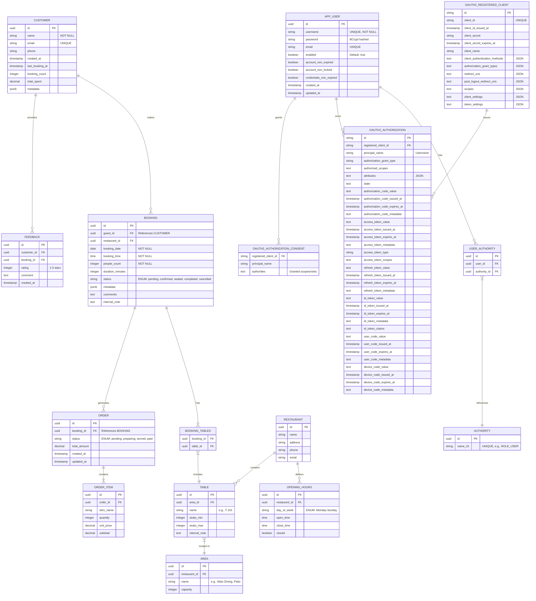

# Data Model - Entity Relationship Diagram

This diagram shows the complete database schema including domain entities, security entities, and OAuth2 entities.



## Entity Categories

### Core Domain Entities

These entities represent the restaurant reservation system business logic:

| Entity           | Purpose                          | Key Relationships                |
| ---------------- | -------------------------------- | -------------------------------- |
| **Customer**     | Customer information and history | → Bookings, Feedback             |
| **Booking**      | Reservation records              | → Customer, Tables (M2M), Orders |
| **Table**        | Restaurant seating inventory     | → Area, Bookings (M2M)           |
| **Area**         | Dining sections/zones            | → Tables, Restaurant             |
| **Order**        | Food/beverage orders             | → Booking, OrderItems            |
| **OrderItem**    | Individual order line items      | → Order                          |
| **Feedback**     | Customer reviews                 | → Customer, Booking              |
| **Restaurant**   | Restaurant information           | → Areas, OpeningHours, Tables    |
| **OpeningHours** | Operating schedule               | → Restaurant                     |

### Security Entities

These entities handle authentication and authorization:

| Entity            | Purpose                 | Storage                         |
| ----------------- | ----------------------- | ------------------------------- |
| **AppUser**       | Application users       | BCrypt password hashing         |
| **Authority**     | Roles (ROLE_USER, etc.) | Name stored in `name_01` column |
| **UserAuthority** | User-Role mapping       | Join table with synthetic ID    |

**Default Roles**:

- `ROLE_USER` - Basic customer access
- `ROLE_OPERATOR` - Staff/manager access
- `ROLE_ADMIN` - Administrative access

**Default Users**:

- admin / admin123 (all roles)
- operator / operator123 (OPERATOR, USER)
- user / user123 (USER only)

### OAuth2 Entities

These entities are part of Spring Authorization Server:

| Entity                         | Purpose                      |
| ------------------------------ | ---------------------------- |
| **OAuth2RegisteredClient**     | OAuth2 client registrations  |
| **OAuth2Authorization**        | Active access/refresh tokens |
| **OAuth2AuthorizationConsent** | User consent records         |

**Seeded OAuth2 Clients**:

1. **mcp-server**: client_credentials, scopes=[backend.read, backend.write]
2. **mcp-client**: client_credentials, scopes=[mcp.read, mcp.write]
3. **frontend-app**: authorization_code + PKCE, public client

## Spring Data JDBC Patterns

### Primary Keys

All entities use `UUID` primary keys:

```java
@Id
private UUID id;
```

### Foreign Keys (AggregateReference)

```java
@Column("guest_id")
private AggregateReference<CustomerEntity, UUID> guest;
```

### One-to-Many (MappedCollection)

```java
@MappedCollection(idColumn = "booking_id")
private Set<BookingTableEntity> tables;
```

### Many-to-Many Join Table

```java
@Table("booking_tables")
public class BookingTableEntity {
    @Column("booking_id")
    private UUID bookingId;

    @Column("table_id")
    private AggregateReference<TableEntity, UUID> table;
}
```

### Embedded Objects

```java
@Embedded.Empty(prefix = "metadata_")
private Metadata metadata;
```

## Database Support

### Development (H2)

```yaml
spring:
  datasource:
    url: jdbc:h2:mem:resos-backend
    driver-class-name: org.h2.Driver
```

### Production (PostgreSQL)

```yaml
spring:
  datasource:
    url: jdbc:postgresql://localhost:5432/resos
    driver-class-name: org.postgresql.Driver
```

### Schema Generation

All tables are created via dynamic Liquibase changelog generation:

1. `SchemaCreator` scans `@Table` entities
2. Generates Liquibase YAML files
3. Liquibase applies changelogs on startup

## Indexes & Constraints

### Unique Constraints

- `customer.email` (UNIQUE)
- `app_user.username` (UNIQUE)
- `app_user.email` (UNIQUE)
- `authority.name_01` (UNIQUE)
- `oauth2_registered_client.client_id` (UNIQUE)

### Foreign Key Constraints

All foreign keys use naming convention: `fk_{table}_{referenced_table}`

- `fk_booking_customer` (booking.guest_id → customer.id)
- `fk_booking_restaurant` (booking.restaurant_id → restaurant.id)
- `fk_table_area` (table.area_id → area.id)
- `fk_user_authority_user` (user_authority.user_id → app_user.id)
- `fk_user_authority_authority` (user_authority.authority_id → authority.id)

### Indexes (Future Enhancement)

Recommended indexes for performance:

- `idx_booking_date` on `booking(booking_date)`
- `idx_booking_status` on `booking(status)`
- `idx_customer_email` on `customer(email)`
- `idx_oauth2_authorization_client` on `oauth2_authorization(registered_client_id)`

## Seed Data

CSV files in `backend/seed-data/`:

- `authorities.csv` - ROLE_USER, ROLE_OPERATOR, ROLE_ADMIN
- `users.csv` - admin, operator, user accounts
- `user-authorities.csv` - user-role mappings
- `areas.csv`, `tables.csv`, `customers.csv`, `feedback.csv`, etc.

Loaded via `DataSeeder` with `@CsvEntityMapper` annotated mappers.

## Critical Files

| File                                                                 | Purpose                    |
| -------------------------------------------------------------------- | -------------------------- |
| `backend/src/main/java/me/pacphi/ai/resos/config/SchemaCreator.java` | Dynamic schema generation  |
| `backend/src/main/resources/db/changelog/db.changelog-master.yml`    | Liquibase master changelog |
| `backend/seed-data/*.csv`                                            | Seed data files            |
| `entities/src/main/java/me/pacphi/ai/resos/jdbc/*Entity.java`        | JDBC entity classes        |
