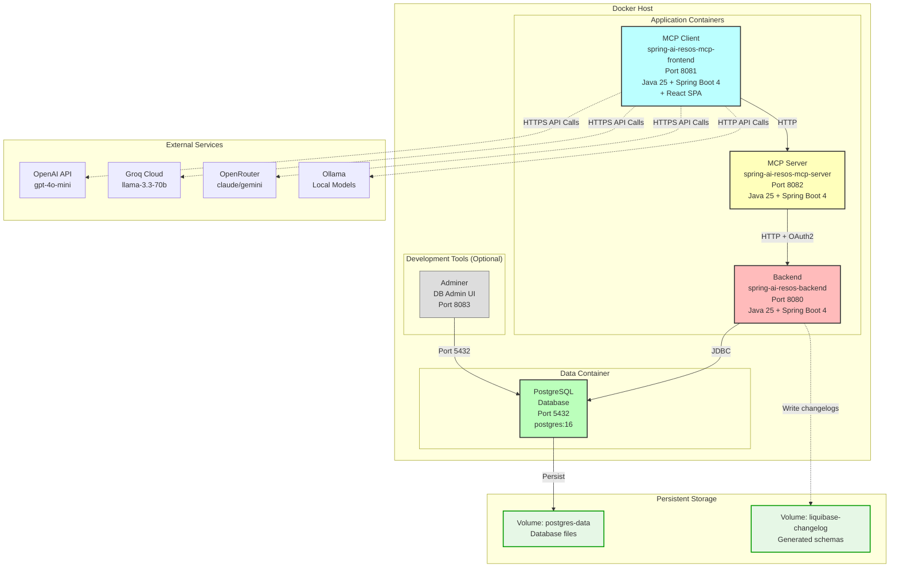
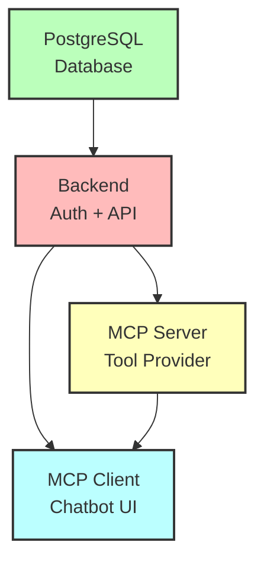

# Deployment Architecture

This diagram shows the Docker Compose deployment configuration and service relationships.



## Docker Compose Configuration

### File Locations

| File | Purpose |
|------|---------|
| `docker/docker-compose.yml` | Full-stack deployment |
| `backend/docker/docker-compose.postgres.yml` | PostgreSQL + backend only |
| `backend/Dockerfile.test` | Backend container image |

### Services Defined

#### Backend Service

```yaml
services:
  backend:
    build:
      context: ../backend
      dockerfile: Dockerfile.test
    image: spring-ai-resos-backend:latest
    container_name: resos-backend
    ports:
      - "8080:8080"
    environment:
      - SPRING_PROFILES_ACTIVE=postgres,dev
      - SPRING_DATASOURCE_URL=jdbc:postgresql://postgres:5432/resos
      - SPRING_DATASOURCE_USERNAME=resos
      - SPRING_DATASOURCE_PASSWORD=resos_password
      - APP_SECURITY_ISSUER_URI=http://backend:8080
    depends_on:
      - postgres
    networks:
      - resos-network
    volumes:
      - liquibase-changelog:/tmp/liquibase
    healthcheck:
      test: ["CMD", "curl", "-f", "http://localhost:8080/actuator/health"]
      interval: 30s
      timeout: 10s
      retries: 3
```

**Key Configuration**:
- **Profiles**: `postgres,dev` - enables PostgreSQL and development settings
- **Database URL**: Uses Docker network hostname `postgres:5432`
- **Issuer URI**: Internal network hostname for OAuth2
- **Volume Mount**: `/tmp/liquibase` for schema changelog persistence
- **Health Check**: Spring Boot Actuator endpoint

#### PostgreSQL Service

```yaml
services:
  postgres:
    image: postgres:16
    container_name: resos-postgres
    ports:
      - "5432:5432"
    environment:
      - POSTGRES_DB=resos
      - POSTGRES_USER=resos
      - POSTGRES_PASSWORD=resos_password
    volumes:
      - postgres-data:/var/lib/postgresql/data
    networks:
      - resos-network
    healthcheck:
      test: ["CMD-SHELL", "pg_isready -U resos"]
      interval: 10s
      timeout: 5s
      retries: 5
```

**Key Configuration**:
- **Image**: PostgreSQL 16 (latest stable)
- **Persistent Volume**: `postgres-data` for database files
- **Health Check**: `pg_isready` command

#### MCP Server Service

```yaml
services:
  mcp-server:
    build:
      context: ../mcp-server
      dockerfile: Dockerfile
    image: spring-ai-resos-mcp-server:latest
    container_name: resos-mcp-server
    ports:
      - "8082:8082"
    environment:
      - SPRING_PROFILES_ACTIVE=dev
      - RESOS_API_ENDPOINT=http://backend:8080/api/v1/resos
      - AUTH_SERVER_URL=http://backend:8080
      - MCP_SERVER_SECRET=${MCP_SERVER_SECRET:-mcp-server-secret}
    depends_on:
      - backend
    networks:
      - resos-network
```

**Key Configuration**:
- **Backend URL**: Internal network hostname `backend:8080`
- **OAuth2**: Connects to backend for token validation and API calls
- **Secret**: OAuth2 client secret from environment variable

#### MCP Client Service

```yaml
services:
  mcp-client:
    build:
      context: ../mcp-client
      dockerfile: Dockerfile
    image: spring-ai-resos-mcp-frontend:latest
    container_name: resos-mcp-client
    ports:
      - "8081:8081"
    environment:
      - SPRING_PROFILES_ACTIVE=openai,dev
      - SPRING_AI_OPENAI_API_KEY=${OPENAI_API_KEY}
      - SPRING_AI_MCP_CLIENT_HTTP_CONNECTIONS_BUTLER_URL=http://mcp-server:8082
      - SPRING_SECURITY_OAUTH2_CLIENT_PROVIDER_FRONTEND_APP_ISSUER_URI=http://backend:8080
      - MCP_CLIENT_SECRET=${MCP_CLIENT_SECRET:-mcp-client-secret}
    depends_on:
      - mcp-server
      - backend
    networks:
      - resos-network
```

**Key Configuration**:
- **LLM API Key**: OpenAI API key from environment
- **MCP Server URL**: Internal network hostname `mcp-server:8082`
- **Auth Server**: Backend for OAuth2 authentication
- **Profiles**: `openai,dev` - OpenAI LLM provider with dev settings

#### Adminer (Optional)

```yaml
services:
  adminer:
    image: adminer:latest
    container_name: resos-adminer
    ports:
      - "8083:8080"
    environment:
      - ADMINER_DEFAULT_SERVER=postgres
    depends_on:
      - postgres
    networks:
      - resos-network
```

**Purpose**: Web-based database management interface

### Networks

```yaml
networks:
  resos-network:
    driver: bridge
```

**Purpose**: Isolated Docker network for inter-service communication

### Volumes

```yaml
volumes:
  postgres-data:
    driver: local
  liquibase-changelog:
    driver: local
```

**Purpose**:
- `postgres-data`: Persist database files across container restarts
- `liquibase-changelog`: Persist generated schema changelogs

## Port Mapping

| Service | Container Port | Host Port | Purpose |
|---------|---------------|-----------|---------|
| Backend | 8080 | 8080 | OAuth2 Auth Server + ResOs API |
| MCP Client | 8081 | 8081 | React SPA + Chat API |
| MCP Server | 8082 | 8082 | MCP Tool Provider |
| PostgreSQL | 5432 | 5432 | Database connections |
| Adminer | 8080 | 8083 | Database admin UI |

## Deployment Commands

### Full Stack Deployment

```bash
# Build and start all services
docker-compose -f docker/docker-compose.yml up --build

# Start in detached mode
docker-compose -f docker/docker-compose.yml up -d

# View logs
docker-compose -f docker/docker-compose.yml logs -f

# Stop all services
docker-compose -f docker/docker-compose.yml down

# Stop and remove volumes (database reset)
docker-compose -f docker/docker-compose.yml down -v
```

### Backend + PostgreSQL Only

```bash
cd backend/docker
docker-compose -f docker-compose.postgres.yml up
```

### Individual Service Management

```bash
# Restart specific service
docker-compose restart backend

# View service logs
docker-compose logs -f mcp-client

# Execute command in container
docker exec -it resos-backend bash

# Database shell access
docker exec -it resos-postgres psql -U resos -d resos
```

## Environment Variables

### Required Variables

Create a `.env` file in the `docker/` directory:

```bash
# LLM API Keys
OPENAI_API_KEY=sk-...
GROQ_API_KEY=gsk_...
OPENROUTER_API_KEY=sk-or-...

# OAuth2 Secrets
MCP_SERVER_SECRET=your-mcp-server-secret
MCP_CLIENT_SECRET=your-mcp-client-secret

# Database (optional, defaults shown)
POSTGRES_DB=resos
POSTGRES_USER=resos
POSTGRES_PASSWORD=resos_password
```

### Optional Variables

```bash
# Change log level
LOGGING_LEVEL_ROOT=INFO
LOGGING_LEVEL_ME_PACPHI=DEBUG

# Change database settings
SPRING_DATASOURCE_URL=jdbc:postgresql://postgres:5432/custom_db

# OAuth2 issuer URL (for external access)
APP_SECURITY_ISSUER_URI=https://your-domain.com
```

## Multi-Stage Dockerfile Example

### Backend Dockerfile

```dockerfile
# Build stage
FROM eclipse-temurin:25-jdk as builder
WORKDIR /app
COPY pom.xml .
COPY src ./src
RUN ./mvnw clean package -DskipTests

# Runtime stage
FROM eclipse-temurin:25-jre
WORKDIR /app
COPY --from=builder /app/target/*.jar app.jar
EXPOSE 8080
ENTRYPOINT ["java", "-jar", "app.jar"]
```

**Benefits**:
- Smaller final image (JRE only)
- Layer caching for faster rebuilds
- Security: No build tools in production image

## Health Checks

Each service implements health checks for reliability:

### Backend Health Check

```bash
curl http://localhost:8080/actuator/health

# Response
{
  "status": "UP",
  "components": {
    "db": {
      "status": "UP",
      "details": {
        "database": "PostgreSQL",
        "validationQuery": "isValid()"
      }
    },
    "diskSpace": {
      "status": "UP"
    },
    "ping": {
      "status": "UP"
    }
  }
}
```

### Docker Compose Health Check

```yaml
healthcheck:
  test: ["CMD", "curl", "-f", "http://localhost:8080/actuator/health"]
  interval: 30s
  timeout: 10s
  retries: 3
  start_period: 40s
```

**Behavior**:
- **start_period**: Grace period for application startup (40s)
- **interval**: Check every 30 seconds
- **timeout**: Fail if check takes > 10 seconds
- **retries**: Mark unhealthy after 3 consecutive failures

## Service Dependencies



**Startup Order**:
1. PostgreSQL starts first
2. Backend starts after PostgreSQL is healthy
3. MCP Server starts after Backend is healthy
4. MCP Client starts after Backend and MCP Server are healthy

## Production Considerations

### Resource Limits

```yaml
services:
  backend:
    deploy:
      resources:
        limits:
          cpus: '2.0'
          memory: 2G
        reservations:
          cpus: '1.0'
          memory: 1G
```

### Logging

```yaml
services:
  backend:
    logging:
      driver: "json-file"
      options:
        max-size: "10m"
        max-file: "3"
```

### Environment-Specific Overrides

```bash
# Development
docker-compose -f docker-compose.yml up

# Production
docker-compose -f docker-compose.yml -f docker-compose.prod.yml up
```

**docker-compose.prod.yml**:
```yaml
services:
  backend:
    environment:
      - SPRING_PROFILES_ACTIVE=postgres,prod
      - LOGGING_LEVEL_ROOT=WARN
      - LOGGING_LEVEL_ME_PACPHI=INFO
    restart: always
```

## Monitoring & Observability

### Prometheus Metrics

Expose Spring Boot Actuator metrics:

```yaml
services:
  backend:
    environment:
      - MANAGEMENT_ENDPOINTS_WEB_EXPOSURE_INCLUDE=health,info,prometheus
```

Access metrics:
```bash
curl http://localhost:8080/actuator/prometheus
```

### Grafana Dashboard

Add Grafana service:

```yaml
services:
  grafana:
    image: grafana/grafana:latest
    ports:
      - "3000:3000"
    volumes:
      - grafana-data:/var/lib/grafana
    depends_on:
      - prometheus
```

## Troubleshooting

### View Container Logs

```bash
# All services
docker-compose logs

# Specific service
docker-compose logs backend

# Follow logs
docker-compose logs -f mcp-client

# Last 100 lines
docker-compose logs --tail=100 mcp-server
```

### Database Connection Issues

```bash
# Test database connectivity from backend
docker exec -it resos-backend bash
curl -v postgres:5432

# Check PostgreSQL logs
docker-compose logs postgres
```

### Network Debugging

```bash
# Inspect network
docker network inspect resos-network

# Check service IP addresses
docker inspect -f '{{range.NetworkSettings.Networks}}{{.IPAddress}}{{end}}' resos-backend
```

## Critical Files

| File | Purpose |
|------|---------|
| `docker/docker-compose.yml` | Full stack deployment |
| `backend/docker/docker-compose.postgres.yml` | Backend + PostgreSQL |
| `backend/Dockerfile.test` | Backend container image |
| `.env` | Environment variables (not in git) |
