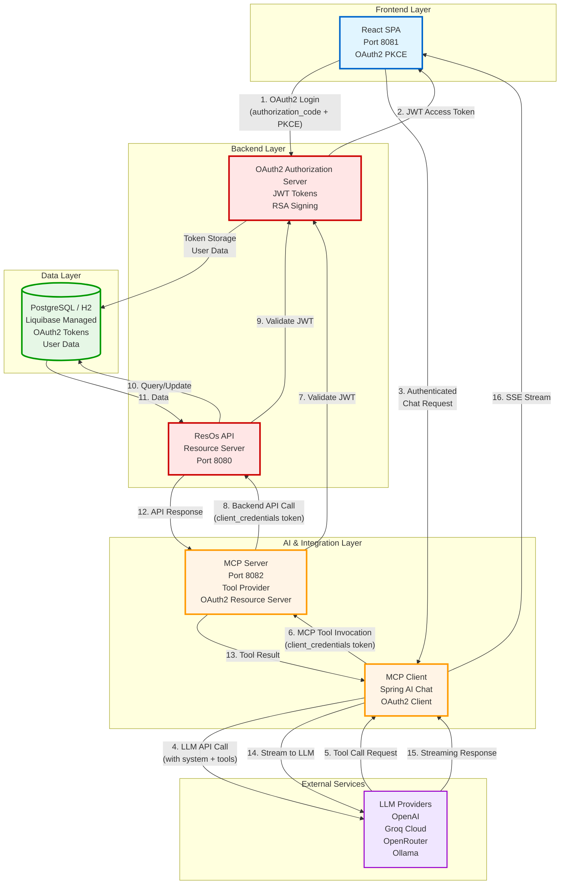

# High-Level Architecture

This diagram shows the complete system architecture with all components and their OAuth2 token flows.

## Component Responsibilities

### Frontend Layer

- **React SPA**: Single-page application providing chat interface
  - OAuth2 PKCE authentication for browser security
  - SSE consumption for streaming responses
  - Markdown rendering with syntax highlighting
  - Dark/light theme support

### AI & Integration Layer

- **MCP Client**: Spring AI chat orchestration
  - Integrates with multiple LLM providers
  - Manages conversation history
  - Coordinates tool invocations
  - OAuth2 client credentials for MCP server communication

- **MCP Server**: Tool provider for AI agents
  - Exposes ResOs tools via Model Context Protocol
  - HTTP Streamable transport (WebMVC)
  - OAuth2 resource server (validates tokens)
  - OAuth2 client (calls backend API)

### Backend Layer

- **Authorization Server**: OAuth2 token issuer
  - JWT tokens with RSA-256 signing
  - User authentication and authorization
  - OAuth2 client registration
  - OIDC support

- **ResOs API**: Restaurant reservation system API
  - Spring Data JDBC for persistence
  - RESTful endpoints
  - OAuth2 resource server protection
  - Dynamic Liquibase schema generation

### Data Layer

- **PostgreSQL/H2**: Relational database
  - OAuth2 token storage
  - User credentials (BCrypt)
  - Restaurant booking data
  - Customer and feedback data

### External Services

- **LLM Providers**: AI model backends
  - OpenAI (gpt-4o-mini)
  - Groq Cloud (llama-3.3-70b-versatile)
  - OpenRouter (claude, gemini)
  - Ollama (local models)

## Security Flow

1. **User Authentication**: Browser redirects to auth server, user logs in, receives JWT
2. **Chat Request**: User sends question to MCP client with auth token
3. **LLM Call**: MCP client calls LLM provider with system prompt and tools
4. **Tool Invocation**: LLM decides to call a tool, MCP client invokes MCP server
5. **Token Validation**: MCP server validates JWT from auth server
6. **Backend Call**: MCP server calls backend API with client credentials token
7. **Response Streaming**: Results stream back through layers to user

## Key Design Principles

- **OAuth2 at Every Layer**: Zero-trust security model
- **Stateless Design**: All services are horizontally scalable
- **Streaming Architecture**: Real-time token-by-token responses
- **API-First**: OpenAPI specification drives code generation
- **Dynamic Schema**: Database schema generated from entities
