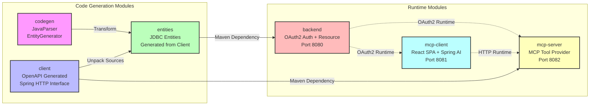

# Module Dependencies

This diagram shows the Maven multi-module structure and build dependencies.



## Module Overview

### Code Generation Modules

#### codegen

- **Purpose**: Entity transformation using JavaParser
- **Artifact**: `spring-ai-resos-codegen`
- **Type**: JAR (no runtime)
- **Used By**: entities module at build time
- **Key Class**: `EntityGenerator`

#### client

- **Purpose**: OpenAPI-generated HTTP client
- **Artifact**: `spring-ai-resos-client`
- **Type**: JAR library
- **Generated By**: OpenAPI Generator Maven plugin
- **Library**: `spring-http-interface` (replaces OpenFeign)
- **Used By**: entities (source unpacking), mcp-server (runtime dependency)

#### entities

- **Purpose**: Spring Data JDBC entities
- **Artifact**: `spring-ai-resos-entities`
- **Type**: JAR library
- **Generated By**: EntityGenerator transformation
- **Used By**: backend (runtime dependency)

### Runtime Modules

#### backend

- **Purpose**: OAuth2 Authorization Server + ResOs API
- **Artifact**: `spring-ai-resos-backend`
- **Type**: Executable JAR
- **Port**: 8080
- **Dependencies**: entities (compile)
- **Provides**: OAuth2 tokens for mcp-server and mcp-client

#### mcp-server

- **Purpose**: MCP server exposing ResOs tools
- **Artifact**: `spring-ai-resos-mcp-server`
- **Type**: Executable JAR
- **Port**: 8082
- **Dependencies**: client (compile)
- **Runtime Auth**: OAuth2 resource server + OAuth2 client

#### mcp-client

- **Purpose**: Chatbot web application
- **Artifact**: `spring-ai-resos-mcp-frontend`
- **Type**: Executable JAR
- **Port**: 8081
- **Dependencies**: None (runtime HTTP connections)
- **Frontend**: React SPA with Vite

## Build Order (Maven Reactor)

The Maven reactor builds modules in this order:

1. **codegen** - JAR with entity transformation utilities
2. **client** - OpenAPI code generation creates HTTP client
3. **entities** - Unpacks client sources, transforms to JDBC entities
4. **Parallel Build**:
   - backend (uses entities)
   - mcp-server (uses client)
   - mcp-client (standalone)

## Dependency Types

### Build-Time Dependencies

- **codegen → entities**: Transformation tool used during build
- **client → entities**: Source code unpacked for transformation
- **entities → backend**: JDBC entities used in backend
- **client → mcp-server**: HTTP client for backend API calls

### Runtime Dependencies

- **MCP Client → MCP Server**: HTTP connections (not Maven dependency)
- **Backend ← MCP Server**: OAuth2 token validation (HTTP)
- **Backend ← MCP Client**: OAuth2 token validation (HTTP)

## Packaging

All modules are packaged as JAR files:

- **Libraries**: client, entities (consumed by other modules)
- **Executables**: backend, mcp-server, mcp-client (Spring Boot fat JARs)
- **Build Tool**: codegen (used during build only)

## Key Configuration Files

| Module     | Location             | Purpose                            |
| ---------- | -------------------- | ---------------------------------- |
| codegen    | `codegen/pom.xml`    | JavaParser dependencies            |
| client     | `client/pom.xml`     | OpenAPI Generator configuration    |
| entities   | `entities/pom.xml`   | Dependency unpacker + exec plugin  |
| backend    | `backend/pom.xml`    | Spring Boot + Security + Data JDBC |
| mcp-server | `mcp-server/pom.xml` | Spring AI MCP Server + OAuth2      |
| mcp-client | `mcp-client/pom.xml` | Spring AI MCP Client + Frontend    |

## Build Commands

```bash
# Full multi-module build
mvn clean install

# Build specific module (dependencies built automatically)
cd backend && mvn clean package

# Skip tests for faster build
mvn clean install -DskipTests

# Parallel build (faster)
mvn clean install -T 1C
```

## Parent POM

The root `pom.xml` provides:

- Spring Boot 4.0.1 parent
- BOM imports (Spring AI, Spring Cloud, Jackson)
- Common build plugins (spotless, git-commit-id, cyclonedx)
- Version properties centralization
- Dependency management
