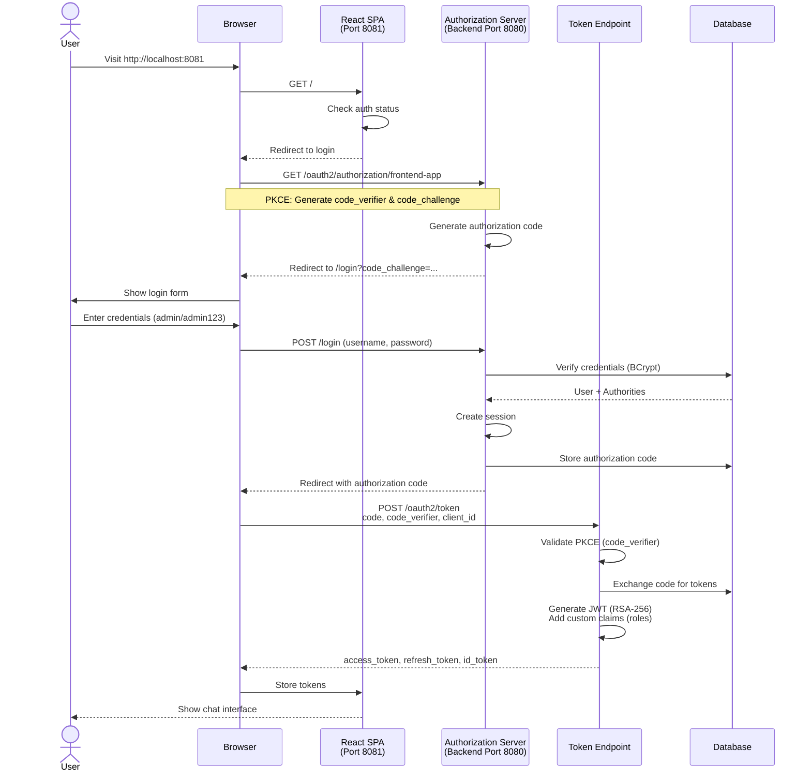
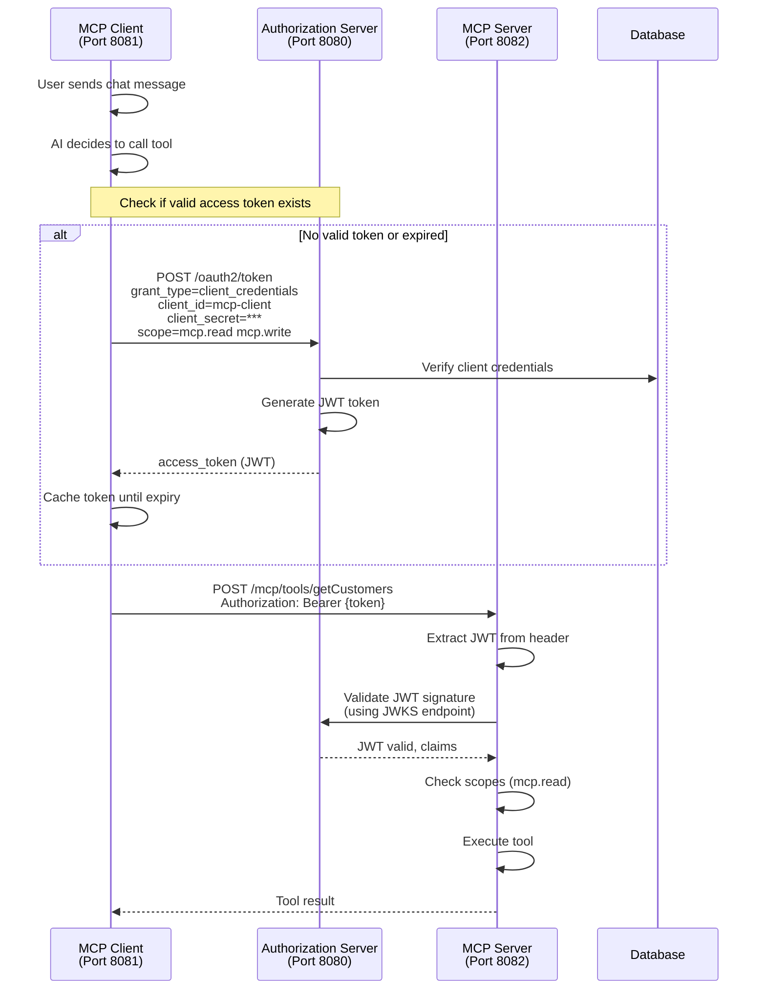
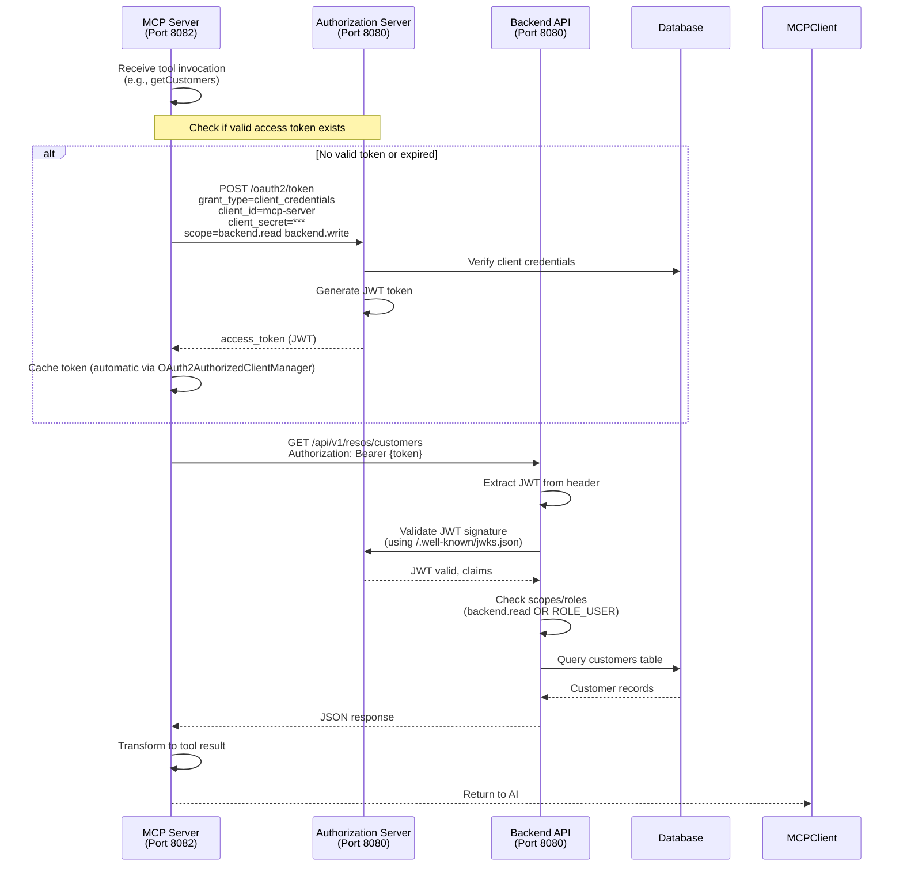
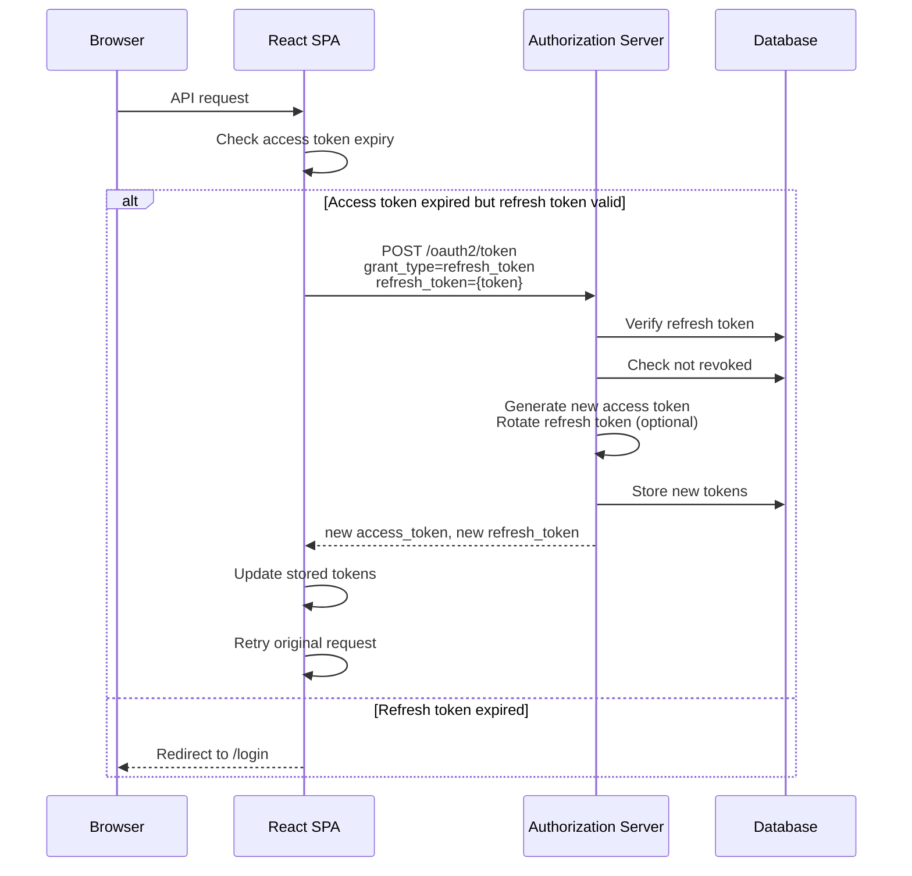
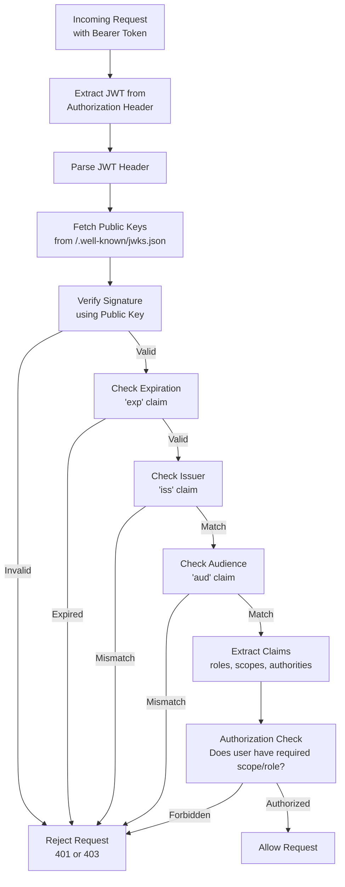

# OAuth2 Flows

This diagram shows all OAuth2 authentication and authorization flows in the system.

## Flow 1: User Authentication (Authorization Code + PKCE)



## Flow 2: MCP Client to MCP Server (Client Credentials)



## Flow 3: MCP Server to Backend API (Client Credentials)



## Flow 4: Token Refresh



## Token Structure

### Access Token (JWT)

**Header**:
```json
{
  "alg": "RS256",
  "typ": "JWT",
  "kid": "generated-key-id"
}
```

**Payload** (custom claims added by JwtTokenCustomizer):
```json
{
  "sub": "admin",
  "aud": ["frontend-app"],
  "nbf": 1704556800,
  "scope": ["openid", "profile", "email", "chat.read", "chat.write"],
  "roles": ["ROLE_ADMIN", "ROLE_OPERATOR", "ROLE_USER"],
  "authorities": ["ROLE_ADMIN", "ROLE_OPERATOR", "ROLE_USER", "SCOPE_openid", "SCOPE_profile"],
  "iss": "http://localhost:8080",
  "exp": 1704560400,
  "iat": 1704556800,
  "jti": "unique-token-id"
}
```

**Signature**: RSA-256 (private key held by Authorization Server)

### Refresh Token

Opaque string (not JWT):
- Stored in database (`oauth2_authorization` table)
- Longer lifetime (hours to days)
- Can be revoked
- Single-use with rotation (optional)

### ID Token (OIDC)

JWT containing user identity:
```json
{
  "sub": "admin",
  "aud": ["frontend-app"],
  "name": "Administrator",
  "email": "admin@example.com",
  "roles": ["ROLE_ADMIN", "ROLE_OPERATOR", "ROLE_USER"],
  "iss": "http://localhost:8080",
  "iat": 1704556800,
  "exp": 1704560400
}
```

## OAuth2 Client Configurations

### Frontend App (React SPA)

```yaml
spring:
  security:
    oauth2:
      client:
        registration:
          frontend-app:
            client-id: frontend-app
            client-authentication-method: none  # Public client
            authorization-grant-type: authorization_code
            redirect-uri: http://localhost:8081/login/oauth2/code/frontend-app
            post-logout-redirect-uri: http://localhost:8081/
            scope:
              - openid
              - profile
              - email
              - chat.read
              - chat.write
        provider:
          frontend-app:
            issuer-uri: http://localhost:8080
```

**PKCE**: Required for public clients (no client secret)

### MCP Client (Service-to-Service)

```yaml
spring:
  security:
    oauth2:
      client:
        registration:
          mcp-client-to-server:
            client-id: mcp-client
            client-secret: ${MCP_CLIENT_SECRET}
            authorization-grant-type: client_credentials
            scope:
              - mcp.read
              - mcp.write
        provider:
          mcp-client-to-server:
            token-uri: http://localhost:8080/oauth2/token
```

### MCP Server (Service-to-Service)

```yaml
spring:
  security:
    oauth2:
      client:
        registration:
          mcp-server:
            client-id: mcp-server
            client-secret: ${MCP_SERVER_SECRET}
            authorization-grant-type: client_credentials
            scope:
              - backend.read
              - backend.write
        provider:
          mcp-server:
            token-uri: http://localhost:8080/oauth2/token
```

## Security Best Practices Demonstrated

1. **PKCE for Public Clients**: Frontend app uses PKCE to prevent authorization code interception
2. **Client Credentials for Services**: Service-to-service communication uses client credentials (not user passwords)
3. **JWT with RSA Signing**: No shared secrets, keys rotated, signature verification via JWKS
4. **Short-lived Access Tokens**: Typically 1 hour expiry
5. **Refresh Token Rotation**: Optional rotation prevents token reuse attacks
6. **Database Token Storage**: Enables revocation and audit trail
7. **Scope-based Authorization**: Fine-grained access control (backend.read vs backend.write)
8. **Role-based Access Control**: User roles encoded in JWT for application-level authorization

## Token Validation Flow



## Endpoints

### Authorization Server Endpoints

| Endpoint | Purpose |
|----------|---------|
| `GET /oauth2/authorize` | Authorization code request |
| `POST /oauth2/token` | Token issuance and refresh |
| `POST /oauth2/revoke` | Token revocation |
| `GET /.well-known/openid-configuration` | OpenID Connect discovery |
| `GET /.well-known/jwks.json` | Public keys for JWT verification |
| `POST /oauth2/introspect` | Token introspection |
| `GET /userinfo` | OIDC user info endpoint |

### Authentication Endpoints

| Endpoint | Purpose |
|----------|---------|
| `GET /login` | Login page (Thymeleaf template) |
| `POST /login` | Form submission |
| `POST /logout` | User logout |
| `GET /api/auth/user` | Current user info (mcp-client) |
| `GET /api/auth/status` | Auth status check (mcp-client) |

## Critical Files

| File | Purpose |
|------|---------|
| `backend/src/main/java/me/pacphi/ai/resos/security/AuthorizationServerConfig.java` | Auth server configuration |
| `backend/src/main/java/me/pacphi/ai/resos/security/JwtTokenCustomizer.java` | Custom JWT claims |
| `mcp-server/src/main/java/me/pacphi/ai/resos/mcp/SecurityConfig.java` | Resource server config |
| `mcp-client/src/main/java/me/pacphi/ai/resos/config/McpClientOAuth2Config.java` | OAuth2 client config |
| `mcp-client/src/main/java/me/pacphi/ai/resos/config/SecurityConfig.java` | Frontend security |
